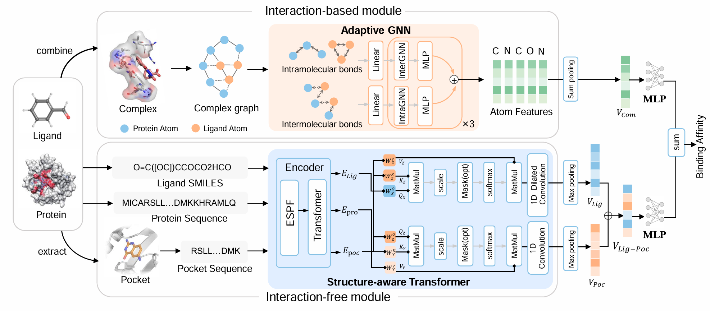

# DualBind

DualBind: Dual-Module Protein-ligand Binding Affinity Prediction with Adaptive GNN and Structure-Aware Transformer



## Overview
DualBind is a powerful deep learning model for predicting protein-ligand binding affinity. It combines an Adaptive Graph Neural Network (GNN) for complex structure and a Structure-Aware Transformer for ligand, protein and pocket representation, providing accurate predictions of binding interactions between proteins and small molecules.


## Requirements

| Package | Version |
|---------|---------|
| matplotlib | 3.9.2 |
| networkx | 3.2.1 |
| numpy | 1.23.5 |
| pandas | 2.2.3 |
| pymol | 2.5.0 |
| rdkit-pypi | 2022.9.5 |
| scikit-learn | 1.1.2 |
| scipy | 1.13.1 |
| seaborn | 0.13.2 |
| torch | 1.10.1 |
| torch-geometric | 2.5.3 |

## Installation

1. Clone the repository:
```bash
git clone <repository-url>
cd DualBind-main
```

2. Create a virtual environment (optional but recommended):
```bash
python -m venv venv
source venv/bin/activate  # On Windows: venv\Scripts\activate
```

3. Install the required packages:
```bash
pip install -r requirements.txt
```

## File Description

- **DualBind.py**: Contains the main dual-module model architecture combining Adaptive GNN and Structure-Aware Transformer
- **SaTransformer.py**: Implements the Structure-Aware Transformer for ligand representation
- **dataset.py**: Handles data loading, preprocessing, and batching for training and evaluation
- **train.py**: Main entry point for model training and evaluation
- **utils.py**: Utility functions for data processing, model evaluation, and visualization
- **config/TrainConfig_DualBind.json**: Configuration file for training parameters and model settings

## Data Format

### Input Files

Each protein-ligand complex should have:
1. **Protein file**: PDB format file containing the protein structure
2. **Ligand file**: RDKit format file containing the ligand structure
3. **Pocket file**: CSV file containing pocket residue information

### Dataset Metadata File

The dataset metadata file (e.g., `toyset.csv`) should have the following columns:
- `pdb_id`: Unique identifier for the protein-ligand complex
- `affinity`: Experimental binding affinity value
- `protein_path`: Path to the protein PDB file
- `ligand_path`: Path to the ligand RDKit file
- `pocket_path`: Path to the pocket CSV file


## Training

To train the DualBind model:

1. Prepare your dataset according to the [Data Format](#data-format) section
2. Update the configuration file `config/TrainConfig_DualBind.json` with your settings
3. Run the training script:

```bash
python train.py
```


